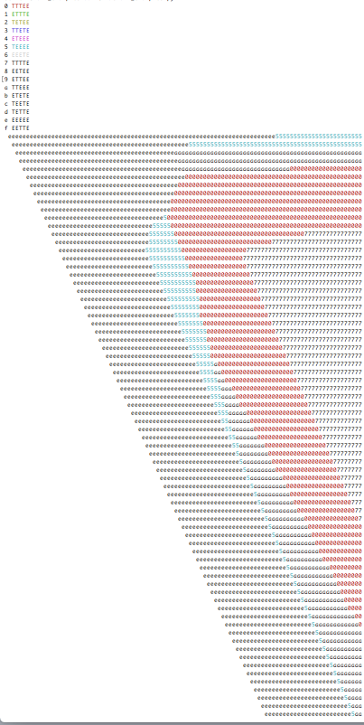

## Details

This internship is proposed for students from the master MPRI, and will be supervised by Spyros Angelopoulos and Chrisoph Dürr, in the Sorbonne Université, LIP6.

## Subject

The traditional framework of combinatorial optimization problems is a clear defined input which is given to an algorithm. The later computes a solution, which has to satisfy some constraints and minimize some cost function.  However it happens that in some situations obtaining the data is in fact the hard part of the problem.  Everyone who has done some intrustrial project can certify.

In this internship we will study a specific scheduling problem, which sounds quite simple. You are given n jobs, each has a processing time p or q, for some given $p < q$.  We, as an algorithm, need to schedule these jobs, and the objectif value is the total completion times of the jobs.  The optimal schedule consists of scheduling first all p-length jobs then all q-length jobs.  However we don't know the processing of each job, unless we execute it, or we make a test. A test takes a single time unit and reveals the processing time.  It is know that the following behavior is dominant for algorthm: If the test reveals length p, then the job can be scheduled right away, otherwise its execution will be delayed towards the end of the schedule.  Hence an algorithm is completely described by a word from $\{T,E\}^n$, where the i-th letter states whether the i-th job considered by the algorithm will be tested or executed unitested.

We propose two measures for an algorithm, the traditionnal competitive ratio, which divides the algorithm's cost with the optimal optimal, and the regret, which substracts these two costs.  The goal of this internship is to identify the best algorithm for each of these measures, as a function of $p,q,n$.  The right approach is to start with small values of $n$, $2,3,4,$ etc, and too see a pattern emerging from these preliminary studies.  The outcome of this work would be either a clear theoretical description of the optimal algorithm, or an experimental study. In both cases a publication in an appropriate venue is expected.

## Bibliography

The student should read during the internship at least the following documents.

- Y. Shaposhnik. Exploration vs. Exploitation: Reducing Uncertainty in Operational Prob- lems. PhD thesis, Sloan School of Management, MIT, 2016. (to be read partially)
- R. Levi. Practice driven scheduling models. Talk at Dagstuhl Seminar 16081: Scheduling, 2016.
- S. Kahan. A model for data in motion. In 23rd Annual ACM Symposium on Theory of Computing (STOC’91), pages 267–277, 1991.

## Appendix

Here are some experiments we already conducted for non adaptive algorithms, for the small instance with 4 jobs.  Every point in the diagram corresponds to a specific value p (the column) and q (the row). The letter indicates the best algorithm for these values. It can be observed that all these algorithms are described by a word of the form $T^*E^+$.  Proving this property would be one possible work for the intern.

