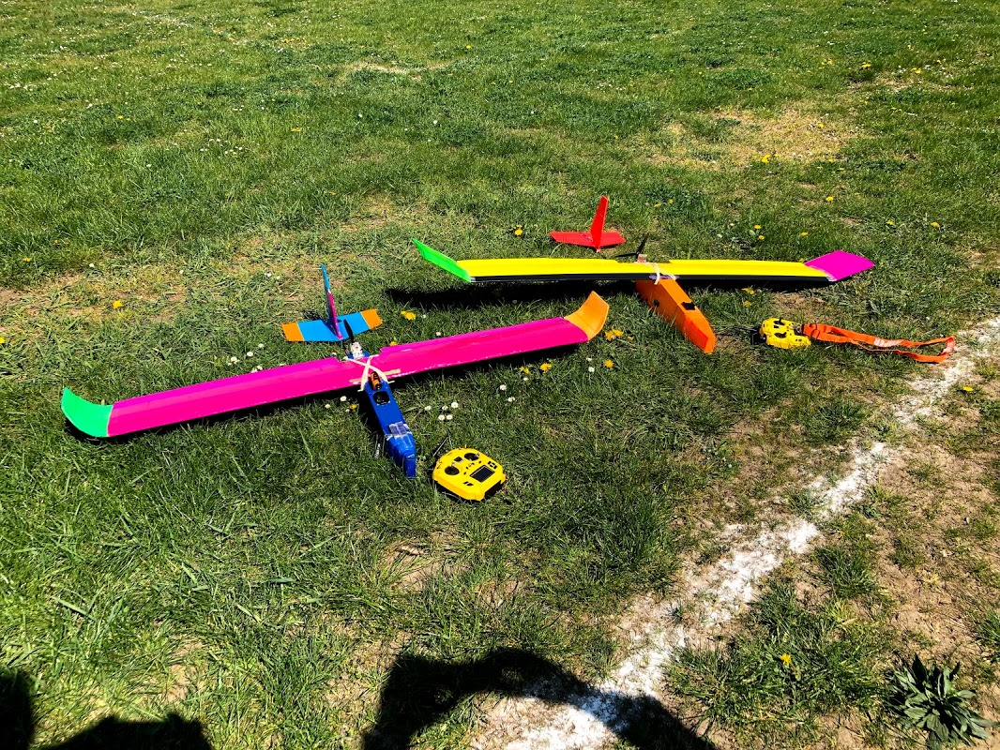

## La conception

Cet avion a été conçu par Andrew Newton, qui ne lui a pas vraiment donné de nom. Je l'appelle *a newton pusher*. C'est avec lui que j'ai appris à voler. Le nez est en mousse qui prend tous les chocs.  Contrairement au modèle d'Andrew Newton on a fait le fuselage dans une boîte en depron 5mm, ou en depron recouvert de papier kraft.  La partie du fuselage sur laquelle repose l'aile est en carton plume, plus solide.

J'ai aussi mis une bosse sur le fuselage pour que l'aile puisse être calée.

Par rapport au plan [plan original](http://newtonairlines.blogspot.com/2015/12/simple-3-channel-trainer.html) j'ai déplacé les servos dans le fuselage pour gagner de poids et j'ai mis des ailerons et des bouts d'ailes arrondis (saumon). L'aile est sans dièdre.  

## Le saumon

J'ai pris une plaque de dépron 6mm chauffée au décapeur et formée au dessus d'un tuyau de grand diamètre.  Ensuite une face est renforcé avec de la fibre de verre collée avec la colle universelle.  Pour l'attacher à l'aile j'ai eu du mal.  J'ai pris des petits morceaux d'une carte de crédit, et un scotch large sur la ligne de contact.

## Boîtes de transport

D'abord j'ai fait une boîte en forme de T pour transporter le *newton pusher*.

Puis j'ai rendu l'empennage complètement démontable, comme sur cette photo.

Ce qui m'a permis de faire une boîte plus petite.

