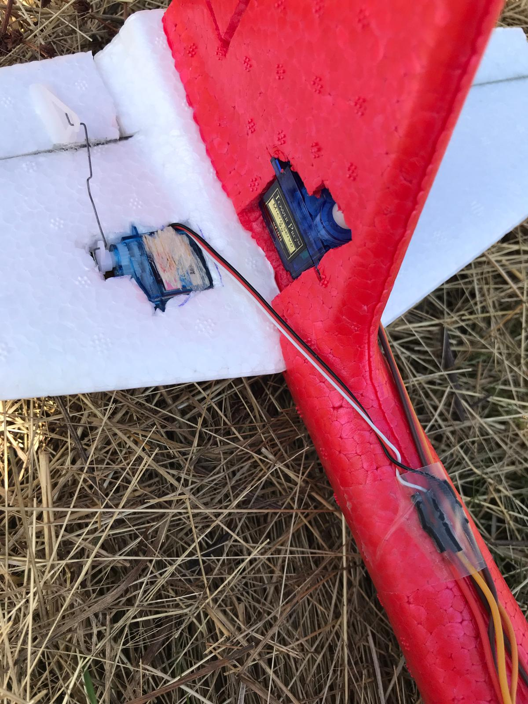
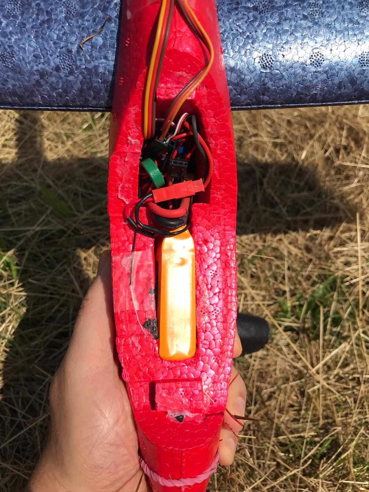

structure
:	planeur en mousse chez *Action* pour 6€. N'existe plus au catalogue à ce jour (août 2025)

préparation
:   mettre de l'alcool à bruler sous la canopé noire, la colle se dissout en quelques minutes

profondeur
:   moteur servo 5g. Insérer une corde à piano pliée en "U" pour rendre les deux surface de contrôle solidaire

direction
:   moteur servo 9g. Je n'avais pas plus léger sous la main

batterie
:	Lipo 2S 850 mAh, assez lourde pour avoir le bon centre de gravité.

UBEC
:   [3€](https://fr.aliexpress.com/item/4001219424525.html) Pour avoir une tension constant de 5 Volts

La profondeur et l'aile reste démontable, ainsi le planeur entre dans la boîte d'origine. Les cables n'ont pas été enfuis dans la surface du fuselage, pour simplifier la construction.

## Problèmes

- Est bien lourd et donc vole seulement par un fort vent en pente.
- La direction n'a pas assez d'autorité. Peut-être la découper plus grande.
- La profondeur est trop sensible. Réduire les débattement.
