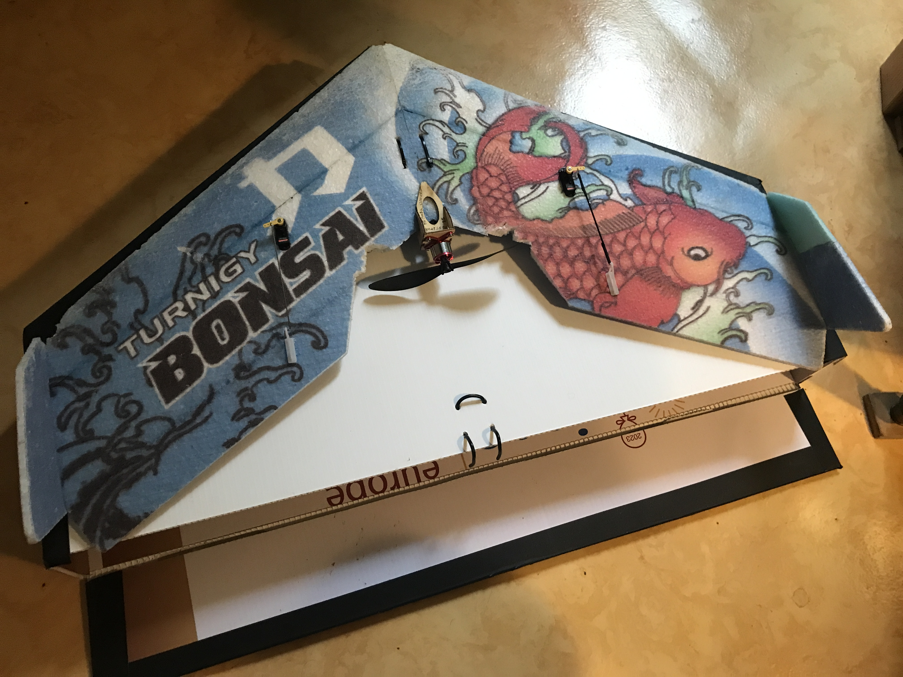
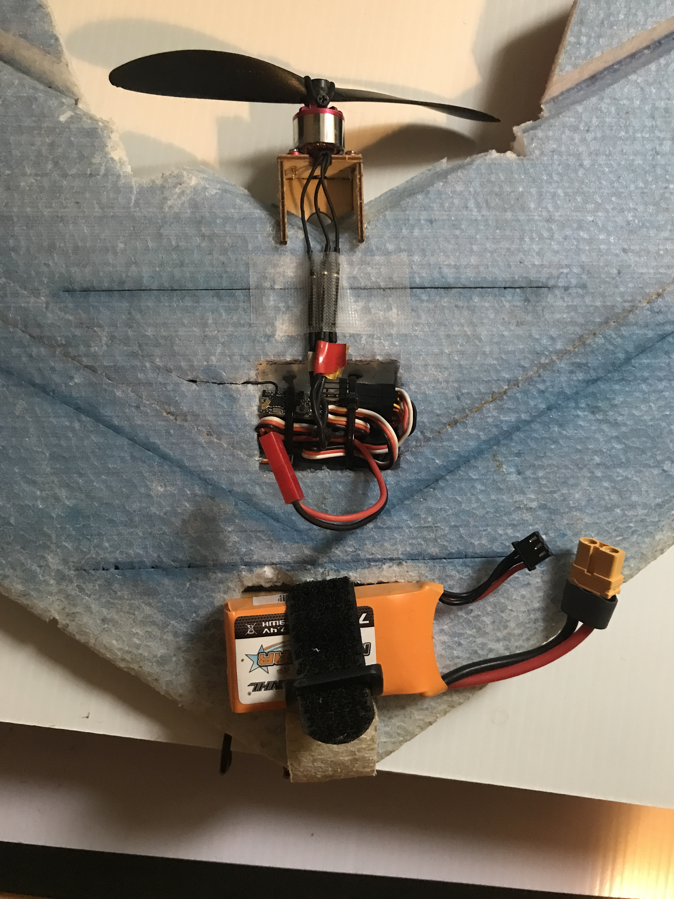

Aile volante Turnigy Bonsai

## Détails techniques

- envergure 60 cm
- poids 171 grams
- batterie 2S 850 mAh 60 grams
- hélice 5040
- moteur AEORC MF1308A 2200kV 23 €. Malheureusement avec un prop saver (anneau d'élastique). Une vis qui accroche l'hélice aurait été plus solide et efficace.
- 2 [servos](https://fr.aliexpress.com/item/1005002650602476.html) digitaux 4.3g avec engrenage en métal 13 € chacun
