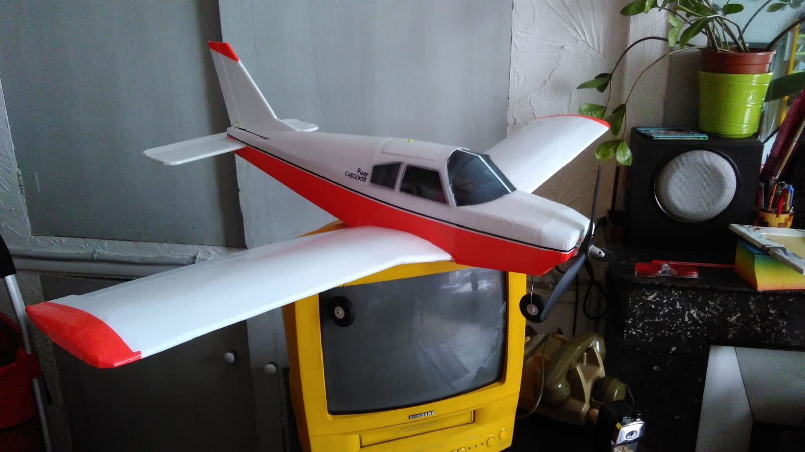

## Piper Cherokee

This low wing plane looks really good in the air.  One imagines Pablo Escobar smuggling drugs or so.  But it also flies well and easily.  I am very happy. So cool to take off from the ground.

## Small problems I had

For the weels I have only 1.5mm thick wire. Which is a bit soft for landing. But also the wheels have quite some slack and vibrate in the air. But once the plane is further from you, the noise is not noticeable.

I used a 50g heavy motor in the front, and constructed everything quite lite. For example I used the Tesa Universal glue, instead of hot glue, and used carbon rods. Result: the plane weights only 580g, but with the heavy motor, the battery has to be very close to the servos, if not even above.

Also my landing gears are a bit too short, and I should have used larger wheels. I cannot take off in short grass. From a more flat path it works though.

## Thank you

Thank you [Julius Perdana](https://www.youtube.com/channel/UC64lnLfKm09f13iayaCOX0A) for the design. I am very happy with this plane.

<figure class="video_container">
  <video controls="true" allowfullscreen="true">
    <source src="cherokee_premier_jour_de_vol.mp4" type="video/mp4">
  </video>
</figure>
