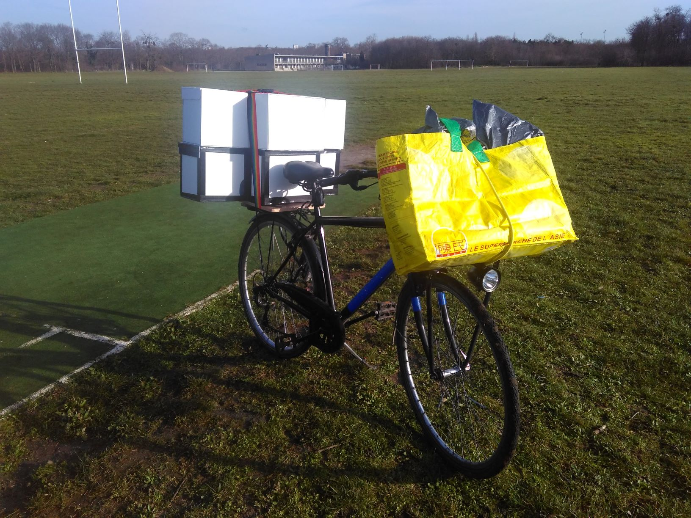

plan original
:	[ici](http://www.lange-flugzeit.de/?post_type=publication&p=1425)

construction
:	En [polystyrène extrudé 3mm](https://www.castorama.fr/panneau-en-polystyrene-extrude-80-x-60-cm-ep-3mm-vendu-par-paquet-de-8-panneaux/3663602884484_CAFR.prd). Recouvert de ruban adhésif coloré.

moteur
:   [AEORC MF2204 1800kV](https://fr.aliexpress.com/item/32751100547.html), 21g

hélice
:	[7060](https://fr.aliexpress.com/item/32899785564.html) pour vol assez lent

ESC
:   [AEORC 10A](https://fr.aliexpress.com/item/32979019897.html)

servo 
:	[5g](https://fr.aliexpress.com/item/32937009729.html), numérique, SG-50 (analogique serait aussi bien et moins cher)

récepteur
:	[Mini Frsky D8](https://fr.aliexpress.com/item/32859265270.html)

batterie
:   2S, 60C, [450mAh](https://fr.aliexpress.com/item/32831635460.html), 18g. (pourrait être plus lourd avec plus de cacacité, je pense.)

roues
:	[devant, en mousse, diamètre 70mm](https://fr.aliexpress.com/item/32828736254.html), [derrière, diamètre 16mm](https://fr.aliexpress.com/item/4000849518141.html)

longéron
:	[en tilleu, carré 3x3mm](https://www.lez-arts.com/longeron-bois-1/longeron-tilleul)

fil acier
:	[2mm pour le train d'atterissage](https://www.lez-arts.com/fil-tube-mtal-1/fil-acier), et 1mm pour l'accastillage

# Problème alimentation

Avec la configuration actuelle, quand on pousse le moteur à ne serait-ce que 50%, alors le testeur de voltage branché sur la batterie mesure une puissance très faible, genre 3.1 Volts et se met à sonner immédiatement.

La [grille](consommation.jpg) indique une consommation de 8A au maximum, pour ce moteur et cette hélice (j'ai fait le test avec pleins d'autres hélices, plus petites). Le ESC ne livre que 10A, peut-être que c'est juste avec les servos numériques qui consomment également.

L'utilisation de batteries avec plus de C (genre 100 C) a résolu le problème.