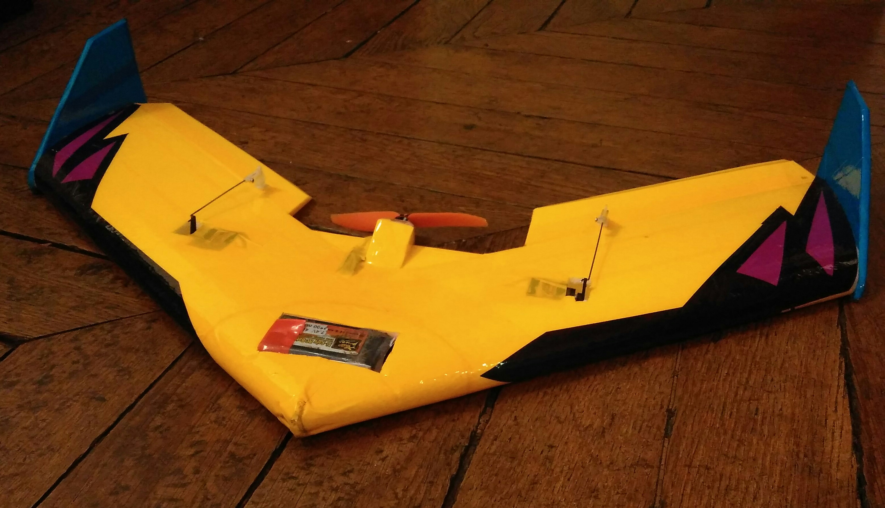
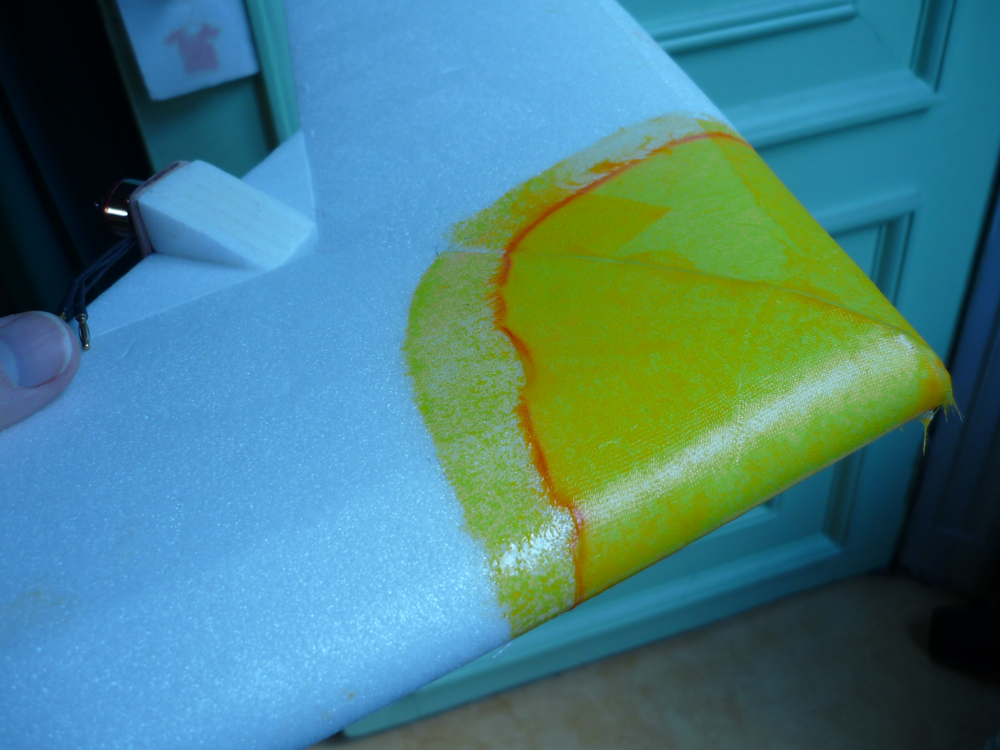

(pardon pour le franglais dans cette page)

construction
:	En [polystyrène extrudé 6mm](https://www.castorama.fr/panneau-en-polystyrene-extrude-6-x-600-x-800-vendu-par-paquet-de-8-panneaux/3663602884491_CAFR.prd). Recouvert de ruban adhésif coloré.

cord
:   16cm

wingpspan, envergure
:   61cm

weight, poids
:   217g (avec la batterie)

charge ailaire, Flächenbelasting, wing load
:   22 g / dm^2

motor, moteur
:   [AEORC AFM1306](https://fr.aliexpress.com/item/32751100547.html), 9g, thrust 186g

hélice
:	5030 fibre de carbone ou en plastique orange

ESC
:   [AEORC 10A](https://fr.aliexpress.com/item/32979019897.html)

récepteur
:	[Mini Frsky D8](https://fr.aliexpress.com/item/32859265270.html)

battery, batterie
:   2S, 40C, 1500mAh, 80g. (pourrait être 60g, et être un peu plus près du nez.)

centre de gravité
:	[entre 13.7 et 14.7cm du nez](https://www.ecalc.ch/cgcalc.php?deeplink=Flying%20Wing%20NumaVIG%2061cm;cm;20.5;16.5;16.5;21;21;0;4.5;6.5;6.5;23;0;6.5;2.5;0.1;21.5;0;w;17.5;17.5;24.5;14;12.6;0;0;0.75;3;4;0;4;7;24;1;0;88;25;10;)

Par rapport au [plan original](https://www.youtube.com/watch?v=XLTTN9yez8U) j'ai renforcé le nez par une seule couche de fibre de verre 50g/m^2 avec de la résine époxy.

Projet décoration: comme tout l'électronique est en surface, autant la jouer *Centre Pompidou* et tout montrer et même souligner.  Mais finalement, une fois une ouverture coupée pour la batterie j'ai profité des cavités ainsi découvertes pour y ranger le ESC dans une, et le récepteur dans l'autre.  Je crois que des couleurs différentes pour le haut et le bas seraient plus pratique.

[Vol pendant le premier jour.](https://photos.app.goo.gl/3FF1oK5V1Wjhgv1a6)