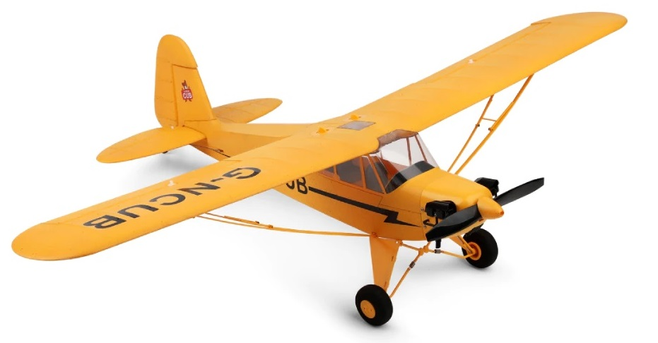

## aussi appelé XK A160 Skylark

- [une petite vidéo](https://www.youtube.com/watch?v=wEm0nwkN6JI) qui explique brièvement comment connecter la radiocommande Jumper à cet avion, et qui montre un problème avec le stabilisateur
- [une autre vidéo](https://www.youtube.com/watch?v=Z46DWNbyR-w) montre que sans le stabilisateur l'avion vole bien. Mais le mec a tout changé, servos et recepteur je crois, et ajouté des trucs sur le bord d'attaque.
- [et encore une autre vidéo](https://www.youtube.com/watch?v=wlqiejDJoDw) de quelqu'un qui a subit des crashs causés par le contrôleur de vol
- dans ce [forum](https://www.rcgroups.com/forums/showthread.php?3625019-XK-A-160-Skylark/page7) les gens préconisent de désactiver la direction, le contrôleur donne un signal trop fort parfois sur la direction, décrochant l'avion. Ou alors juste réduire la surface de la direction. Je me demande si le contrôleur n'a pas été conçu pour un modèle XK A600, qui avait une direction plus petite.
- la liste des [canaux](https://www.multi-module.org/using-the-module/protocol-details/kn) du récepteur et leurs fonctions
- pièces [détachées](https://www.aliexpress.com/item/4001159164938.html)
- batteries 2S 500mAh (difficile à choisir à cause des dimensions)
