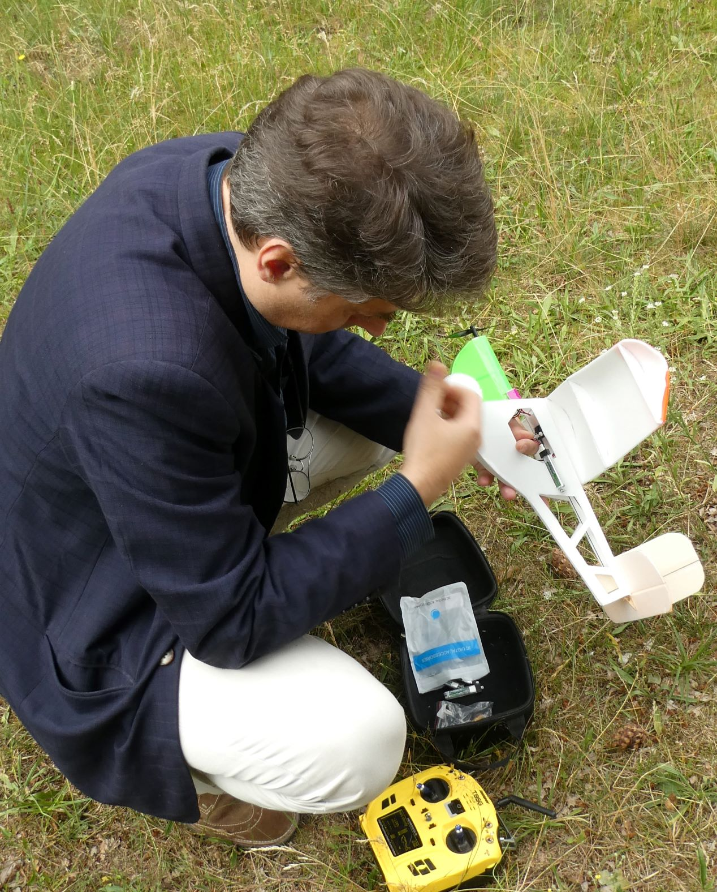
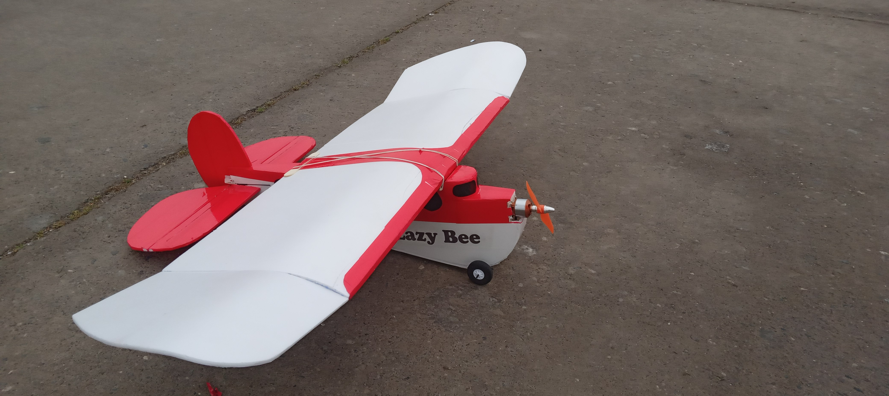
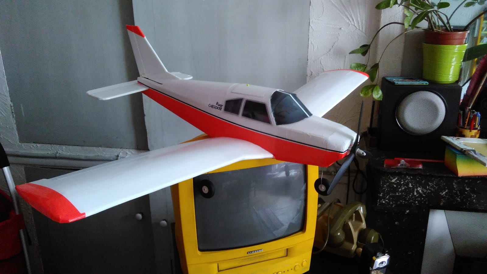

## Avions (et voilier)

(beaucoup n'existent plus)

Cheese                  |  Détails
:-------------------------:|:-------------------------:
  |  [MinimumRC CJ-6](https://fr.aliexpress.com/item/32826439827.html) : Tout en balsa. L'électronique est difficile à acheter, en tout cas à un prix raisonnable.  
 | [Nutball](nutball) : Super simple à fabriquer et pas si facile à voler.
 | [Piper Cub](g-ncub/): réaliste, joli, contrôleur mal conçu. 
 |  [Simple CUB](https://www.flitetest.com/articles/diy-ft-simple-cub-build) --- jolie forme, mais le mien est devenu beaucoup trop lourd. Aussi il prend beaucoup le vent et a besoin d'une météo calme.  J'aime bien le concept *swappable* de Flite Test. On met ESC, récepteur et moteur sur un tiroir, qu'on peut déplacer de modèle en modèle. 
 | [Planeur LIDL](LIDL-pitcherons) avec des ailes à incidence intégrale. Intéressant à voler. Mais impossible à rattraper quand il décroche.
 | [LIDL aile volante](https://photos.app.goo.gl/ysvFdg6jxGsQ5peB7): conception [Smileyflyer](https://www.youtube.com/watch?v=cc494kIiwVI&t=432s). Pareil, impossible à rattraper quand il décroche.
 | [Azul 48](azul48/) 
 | [Le planeur action](action/) 
 | Notre [version](a_newton_pusher/) d'un planeur de Andrew Newton.  Je trouve qu'il est parfait pour débuter, car il peut encaisser un atterrissage sur le nez, et si on est en difficulté on peut simplement couper le moteur et le laisser planer.  
 | [Planeur Savattero 60](https://photos.app.goo.gl/FyKPBxDqGvVzvd3W8) --- Inspiré de ce [planeur](https://www.flitetest.com/articles/cheap-simple-foam-dlg-with-good-performance) --- Je trouve que l'aile n'a pas assez de dièdre. 
 | [Planeur DLG PUG2](pug2/)
 | [Le planeur libellule](libellule/)
 | [Slowly](https://www.rcgroups.com/forums/showthread.php?1686460-Sowly-A-magnificent-Land-and-Lake-Build): conception Christian Huber. 
 | [Small Slowly](small_slowly/).  Le moteur a lâché une fois. J'ai lu quelque part que ces moteurs avec brosse ont une durée de vie de 10 heures, c'est vrai?  Maintenant équipé avec le moteur [AEORC AFM1306](https://fr.aliexpress.com/item/32751100547.html) en 2S. Finalement abandonné, car mauvaise combininaison moteur-ESC qui est trop lourd. 
 | [Micro Skyhunter](micro_sky_hunter/): un petit avion bien pour le vol en immersion.  Volé pendant trop de vent sans me tenir à distance des arbres.  Conception Andrew Newton. La [version 2](https://www.modelisme.com/forum/aero-construction/210904-micro-hunter-scratch-build.html) est démontable. 
 | [Lazy Bee](lazy-bee/) Abandonné au Chili.
 | [Mini Lazy Bee](mini-lazy-bee)
 |[Flying Wing NumaVIG](flying-wing-numavig/)
 | [Bonsai](bonsai/)
 | [Buschtrottel](buschtrottel/) 
 | [Piper Cherokee](cherokee/)
 | [Chopper](chopper/): un petit avion, difficile à transporter, nécessite peu de vent. 
 |  [Valise](valise/) 
 |  [Jif 65](jif/)

Certaines photos sont [ici](https://photos.app.goo.gl/TNx8DpYNiykMsnXA6).
