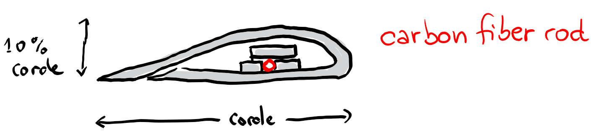
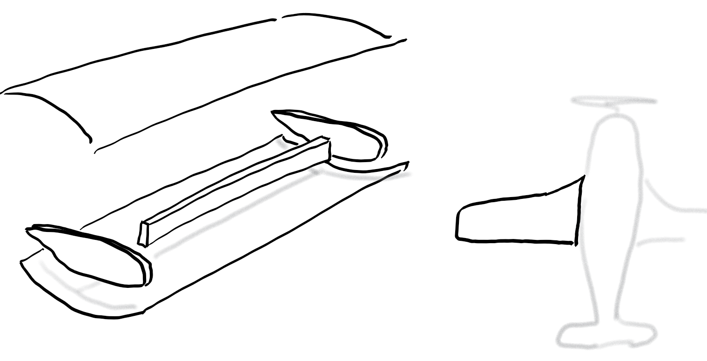
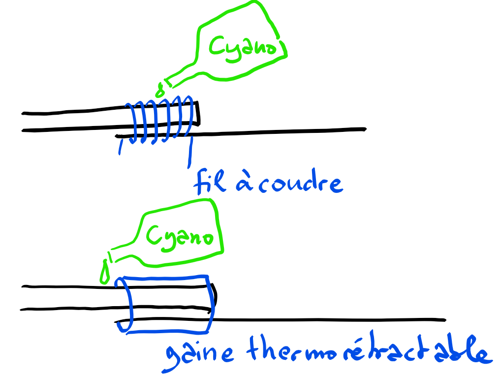
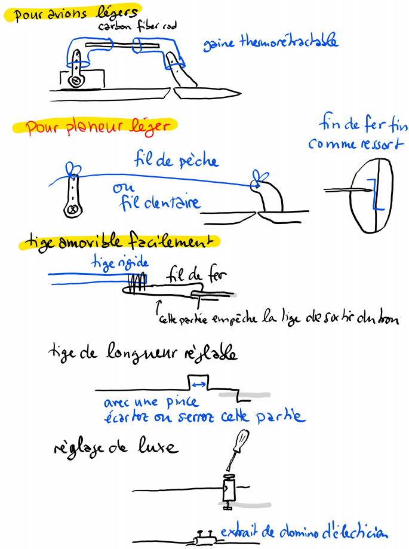
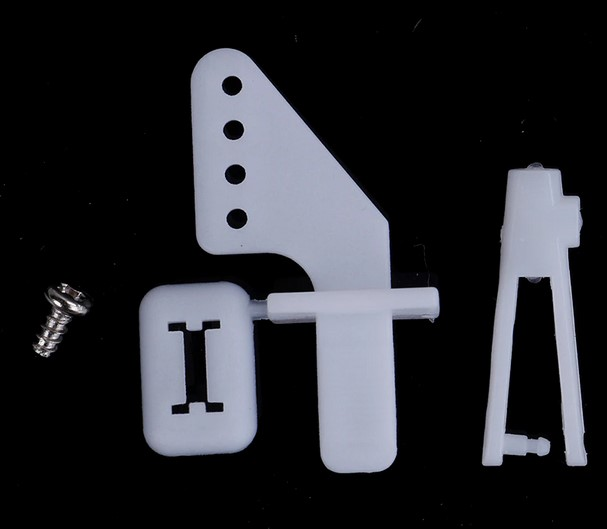

    Ahhh ... fais gaffe quand même !

## Aile en Depron : Armin Wing

{:width="450"}

Une construction d'aile en depron, décrite par Ed de [Experimental Airlines](https://www.youtube.com/watch?v=karr67ZYho4) et puis par [Andrew Newton](http://newtonairlines.blogspot.com/2014/05/better-airfoil-wing-build.html).  Très simple à mettre en œuvre.  Peut être renforcée par une tige en carbone.

Cette construction permet de créer des ailes toutes droites seulement. D'ailleurs regardez les modèles d'experimental airlines, comme le [photon](https://www.youtube.com/watch?v=ZfqGrzCKauw).  Pratiquement des rectangles assemblés.

Si vous voulez des bouts d'ailes recourbées vers haut, il faut ruser un peu, arrêter les renforts intérieurs avant et coller parties hautes et bas, après leur avoir donné la forme voulue.

##  Aile en Depron : dans le style de Julius Perdana

{:width="450"}

Nécessite de courber le Depron après l'avoir chauffé par exemple. L'aile est très épaisse et peut se passer d'un renfort.  Cette construction permet des formes intéressantes.

## Atterissage

[Voici](https://www.modelairplanenews.com/land-like-a-pro/#visitor_pref_pop) la procédure bien décrite.

## Batteries

Les batteries Lipo (Lithium polymère) viennent avec trois indications. 
- Le nombre de cellules, 1S, 2S, etc.  Celui-ci définit le voltage, genre 4.22 Volts par cellule chargée à bloc.
- La capacité, genre 1000 mAh.
- Le niveau de délivrance, genre 20C, 35C.  Une batterie 600mAh 20C, peut délivrer 20 * 0.6 = 12 Ampères.  Ce niveau doit satisfaire la demande du moteur. Les moteurs bien documentés viennent avec une grille, qui indique pour le nombre de cellules de la batterie et la taille de l'hélice le nombre d'ampères consommées.   Le ESC (electronic speed controler) doit être adapté à ce nombre, et même être un peu plus haut de peut-être 20% pour avoir de la tolérance.

Il ne faut pas vider les batteries trop. Le niveau critique n'est pas très clair pour moi. Si vous ne déscendez jamais en dessous de 3.7 Volts par batteries, vous allez les garder longtemps, mais je pense que 3.5 V est acceptable.

Trois mécanismes peuvent aider à respecter le seuil de charge minimale.  Un minuteur sur votre radio émetteur.  Un mécanisme sur des ESC de bonne qualité, qui baisse le moteur quand un seuil est atteint. Et enfin un testeur de voltage à connecter sur le cable de charge de votre batterie.  Il vous signale le niveau bas de la batterie par une alarme.  Je connais deux types, un qui affiche le niveau par des diodes vertes, puis rouges. Installé à l'extérieur du fuselage, vous pouvez le voir en vol d'un coin de l'oeil.  Puis un deuxième type affiche par LED le voltage. Impossible de relever l'affiche en vol, mais c'est pratique au sol.  **Attention** à ne pas laisser brancher ce testeur trop longtemps quand l'avion est au sol. Il ne décharge pas les batteries de manière équilibrée il me semble. 

Les batteries 18650 ont plus d'énergie par poids et pourraient être intéressants à utiliser dans des vols longs. Mais ils ne peuvent pas fournir autant de puissance que les batteries Lipo, ont une résistance intérieure plus grande, mais peuvent se vider jusqu'à 2 Vols par cellule.   [Voici](https://www.youtube.com/watch?v=UB8fas6zBSE) une comparaison faite par Tom Stanton, qui conclu après des tests très ennuyeux que les batteries 18650 sont un bon choix pour les planeurs, mais pas pour des vols qui ont besoin de puissance.

Ces batteries sont également une option intéresante pour votre radio émetteur, nécessitant des recharges moins fréquement.

## Canaux

Voici l'association des canaux aux moteurs servos que j'utilise habituellement.
Écrire AETR ou AETRA près du récepteur pour mémoriser l'ordre de connexion (le premier A en rouge, le dernier en vert). Également marquer les câbles pour les servos ailerons avec des couleurs rouge (gauche) et vert (droite).

1. left aileron
2. elevator
3. throttle
4. rudder
5. right aileron

## Clubs

- [Les Goélands à Montreuil](http://goelmodaero.wixsite.com/goelmod/rc-exterieure)
- [Queue en brie](https://www.google.com/maps/@48.7742232,2.5729774,157m/data=!3m1!1e3?hl=en), notre terrain officiel avec piste

## Cockpits

- [jolie collection de photos](http://www.laboiteverte.fr/21-cockpits-davions/)

## Construction maison

En anglais: *scratch build*.
Plusieurs sites web ou canaux vidéos que je j'aime.

- [FliteTest](https://www.flitetest.com/) des vidéos très professionnels, avec des américains qui se la pêtent un peu, et vendent leur kits de fabrication.  Ils font tout avec du Dollar Tree Foam  et de la colle chaude. Fabrication rapide.
C'est difficile de trouver du matériel équivalent en France.
- [Experimental Airlines](https://www.youtube.com/user/ExperimentalAirlines) : un autre américain, apprend bien comment faire des ailes, recouvrir de ruban adhésif la surface.  Des constructions simples et robustes. A arrêté ce loisir depuis quelques années.
- [Andrew Newton](http://newtonairlines.blogspot.com/) un australien, qui a la chance d'aller voler facilement au bord d'une pente au bord de la mer.  Beaucoup de comparaison de matériels.
- [Erwin Beizeiten](https://www.youtube.com/channel/UCjSQBeTUKgqESVG9P7XJhmg) un autrichien qui construit dans un atelier tout rangé.
- [Papy Kilowatt](http://papykilowatt.free.fr/) un belge qui avait atteint un niveau de précision et de réalisme incroyable.
- [Jivaro models](http://www.jivaro-models.org/) une collection française d'avions de toutes sortes.
- [Paul K. Johnson, seulement balsa](http://www.airfieldmodels.com/information_source/how_to_articles_for_model_builders/index.htm)
- [NumaVIG](https://www.youtube.com/channel/UCsM-eoJt17xnWMNNpwhf8Nw) un russe je pense, sans musique, sans parole, hypnotisant et calme.  Magnifique.
- [Julius Perdana](https://www.youtube.com/user/julescrafter) un indonésien. Fait de beaux modèles et montre tous les détails.

## Découpe par ordinateur

- [CncFab](https://cncfab.renaudiltis.com/) par Renaud Iltis.

## Deviation

C'est le logiciel qui tourne sur ma radio commande, [Jumper T8SG](https://www.banggood.com/Jumper-T8SG-V2_0-Plus-Hall-Gimbal-Multi-protocol-Advanced-2_7-OLED-Transmitter-for-Flysky-Frsky-p-1257102.html).  J'ai choisi cette radio commande pour pouvoir parler à des récepteurs de plusieurs marques.  Avec un peu de bricolage on peut la faire [parler](https://www.deviationtx.com/wiki/voiceoutput). Gadget? En tout cas on a un retour des commandes sans perdre des yeux son avion.  

Voici comment j'ai configuré le logiciel de l'émetteur Jumper.
D'abord pour mettre un minuteur proportionnel à la commande moteur, je dois créer un canal virtuel, appelé disons "gaz100".  L'idée est de traduire l'entrée *Throttle* qui varie de -100 à +100 vers un canal variant entre 0 et +100.

~~~
[virtchan1]
name=gaz100
template=simple
[mixer]
src=THR
dest=Virt1
scalar=50
offset=50
curvetype=expo
points=0,0
~~~

Puis je programme deux minuteurs, les deux commandés par l'interrupteur H. Le premier compte juste le temps de vol. Le deuxième est un compte à rebours, qui diminue proportionnelement au canal Virt1.

~~~
[timer1]
src=SW H1
resetsrc=SW H0
[timer2]
type=cntdn-prop
src=Virt1
resetsrc=SW H0
time=360
~~~

Pour les ailerons j'ai programmé les canaux 1 et 5, pour l'aileron gauche et droite. Sur l'interrupteur C2 je les mets tous les deux en position haute maximale, ce qui est la position de l'aérofrein.  Avec mon règlage les ailerons débattent de +/- 1 centimètre et l'aérofrein monte à +3cm.

~~~
[channel1]
template=complex
[mixer]
src=AIL
dest=Ch1
scalar=60
[mixer]
src=AIL
dest=Ch1
switch=SW C2
scalar=-125
curvetype=fixed

[channel5]
template=complex
[mixer]
src=AIL
dest=Ch5
scalar=60
[mixer]
src=AIL
dest=Ch5
switch=SW C2
curvetype=fixed
~~~

## Drones

- [acrobatique et sportif](https://www.youtube.com/watch?v=Iz42lvAVbiI)

## Élastique

Voici des avions propulsés par un moteur avec élastique.

- [depron et bambou](https://www.youtube.com/watch?v=IIxm27JYnOI&list=PLRvRak4_g1MFiVh4VyPWio8DHTZhcE5xQ&index=11&t=0s)
- [bambou et sac nylon](https://www.youtube.com/watch?v=MzL8wztyVMU&list=PLRvRak4_g1MFiVh4VyPWio8DHTZhcE5xQ&index=12&t=0s)

## Empannage

Il s'agit de la queue de l'avion avec la dérive et la profondeur. C'est une pièce délicate à transporter d'autant plus qu'elle doit être super legère. Chaque gramme de plus dans l'empennage nécessite peut être 3 grammes de plus dans le nez.  [Voici](https://mikaeromodelisme.wordpress.com/2013/08/31/empennage-papillon-demontable/) une jolie méthode pour rendre le tout démontable.

## F3K

Dans ce loisir il y a des compétitions, avec beaucoup de catégories. Donc on en trouve forcément une où on peut gagner des médailles. Mais ce qui m'attire ce sont les avions de la catégorie F3k. Des planeurs sans hélice qu'on lance à la main par le saumon. C'est beau. Et super technique pour fabriquer un avion de haute performance.

- [Jan Henning](https://www.youtube.com/watch?v=p5BsfmUrtDM&list=PLZdOy4nGe2QKGPChQ_nEaEKesgN3__jY1)

## Frein moteur

Le [frein moteur](https://www.youtube.com/watch?v=qYHJgg_vvSQ) est une fonctionnalité qui se programme sur le ESC. Sans le frein, quand le moteur est à l’arrêt il reste en rotation libre, et l'hélice continue à tourner sous l'effet du vent, et augmente ainsi la résistance dans l'air. Avec le frein, le moteur a une résistance interne à l’arrêt et en général l'hélice reste immobile et parfois bien alignée avec l'aile.  Autre avantage : à l'atterrissage l'hélice risque moins de casser. 

[Voici](https://www.youtube.com/watch?v=g5eUrI6vxco) une expérience convaincante sur la résistance d'une hélice avec ou sans frein moteur.

## Hayao Miyazaki

- [Flaptter 19-5 of LAPUTA Castle in the Sky](https://www.youtube.com/watch?v=a6dGygmGo8M&t=175s)
- [Nausicaa avec pilote humain](https://www.youtube.com/watch?v=X0x7GS53EbA)
- [Nausicaa en radiocommandé](https://www.youtube.com/watch?v=4yYKNSY-TQI)

## Liaison carbonne-fer

{:width="350"}

## Marouflage

- Papy Kilowatt a expliqué [ici](http://papykilowatt.free.fr/html/page_trucs.htm) comment il maroufle avec du papier ses avions.
- [voici](https://www.flitetest.com/articles/super-strong-waterproof-foam-core) une étude comparative sur la solidité et prix de plusieurs méthodes pour créer une surface sandwich avec un cœur depron.  En gros, un marouflage avec du papier Kraft n'a pas de très bonnes caractéristiques contre deux couches de fibre de verre avec de la résine epoxy, qui elle n'est pas si chère que ça. Mais le choix de la colle utilisée est très important ici.

## Mousses

Voici différentes mousses qui servent pour la construction.  Je ne vois pas encore très clair entre les noms techniques.

### Mousse GVector

Une mousse vendue par [Graupner](https://www.modelisme.com/forum/aero-construction/207566-construire-vector-board.html), en planches de 1m fois 30cm.  Je ne l'ai pas encore essayé ni vue de mes propres yeux.

###  Mousse polystyrène expansé (Expanded polystyrene (EPS))

Des gros blocs d'isolants, souvent rose, ou blanc cassé ou bleu clair. Existe en plusieurs densités. Se découpe facile au fil chaud.  Il faut le poncer pour pouvoir coller sur la surface. Si du ruban adhésif n'adhère pas, on peut passer d'abord une fine couche de colle universelle diluée pour lisser la surface.

* [Conseils de traitement](http://www.fly2air.com/tipps/Styrodurbau/index-Styrodurbau.htm).

Je pense que les avions moulés, comme le planeur LIDL sont faits de cette matière, mais avec des bulles beaucoup plus grandes, et plus flexible du coup.

###  Mousse polystyrène extrudé (Extruded polystyrene (XPS))

C'est une mousse, à la surface lisse.  On peut la tordre en la chauffant avec un décapeur, puis la plier sur un tube ou un coin de table arrondi. Il parait que de la vapeur d'eau ou un sèche cheveux peut aussi faire l'affaire, mais je n'ai pas réussi, pas assez chaud.  Ou alors coller un film ou ruban adhésif sur une face pour prendre la tension, puis la plier sans qu'elle se brise.  De toute façon recouvrir cette mousse permet de la rendre plus solide. Par exemple avec un ruban adhésif coloré, comme ceux vendus par exemple chez Leroy Merlin pour les déménagements (une couleur par chambre). Sinon voir la section Marouflage.

|nom                                            |densité     |
|-----------------------------------------------|------------|
| dollar tree foam board                        | 297 g/m^2  |
|rogier et plé, mouse recouvert de papier kraft | 414 g/m^2  |
| [Depron](https://www.leroymerlin.fr/v3/p/produits/carton-de-20-plaques-mur-depron-l-1000-x-l-1000-x-ep-3-mm-e1400774731) 6mm, Leroy merlin par exemple          | 198 g/m^2  |

###  Mousse polypropylène extrudé

C'est une mousse avec de grosses bulles.  Elle est pratiquement incassable.  Un nez d'avion dans ce matériel est idéal pour absorber les chocs. Difficile de traiter la surface, comme elle n'est pas lisse, les rubans adhésifs n'adhèrent pas. Un peu trop flexible pour fabriquer le reste de l'avion avec cette mousse.

## Modèles

Les modèles que j'aime bien, et que j'aimerais fabriquer.

- [Pyth 700](http://www.jivaro-models.org/pyth700/page_pyth_700.html) une aile volante pour l'adrénaline. Facile à fabriquer et très solide.
- [Piper 120cm en Balsa](https://fr.aliexpress.com/item/32823979442.html)
- [Un planeur en mousse, style LIDL glider, motorisé par Alekseï Elimov](http://forum.rcdesign.ru/blogs/4414/blog23781.html)

## Monde

[Allemagne](https://www.youtube.com/watch?v=5IoODRH1TWg),
[Algérie](https://www.youtube.com/watch?v=pkT6ph5hnI0),
[Cambodge?](https://www.youtube.com/watch?v=VTY1XNBB7Zw&list=PLRvRak4_g1MFiVh4VyPWio8DHTZhcE5xQ&index=7&t=0s),
[Chili](https://www.youtube.com/watch?v=uR6z-mhI2Rw),
[Corée](https://www.youtube.com/watch?v=BXKDoljaN5M&list=PLRvRak4_g1MFiVh4VyPWio8DHTZhcE5xQ&index=2&t=0s),
[France, Dune du Pyla](https://www.youtube.com/watch?v=LvHpH7abGMw),
[France, Île d'Oléron](https://www.youtube.com/watch?v=YOiyY4KO8Ko),
[Inde (Bengal)](https://www.youtube.com/watch?v=phg_-ze8iuE&list=PLRvRak4_g1MFiVh4VyPWio8DHTZhcE5xQ&index=10&t=0s),
[Inde, dans les arrières cours](https://www.youtube.com/watch?v=LU1qoYxjeyw&list=PLRvRak4_g1MFiVh4VyPWio8DHTZhcE5xQ&index=6&t=0s),
[Japon](https://www.youtube.com/watch?v=JmRkxZT4XhY),
[Indonésie](https://www.youtube.com/watch?v=3lq_Rbq6jxo&list=PLRvRak4_g1MFiVh4VyPWio8DHTZhcE5xQ&index=9&t=0s),
[Maroc](https://www.youtube.com/watch?v=EZlvMI35p5I&t=5s),
[Suisse](https://www.youtube.com/watch?v=xa-jmbQRw_8),
[Thailand](https://www.youtube.com/watch?v=148qPteAXQ0),
[Vietnam](https://www.youtube.com/watch?v=nDO9c2nMylU).

## Papier

[The paper airplane guy](https://www.youtube.com/watch?v=3BNg4fDJC8A&list=PLRvRak4_g1MFiVh4VyPWio8DHTZhcE5xQ&index=4&t=384s)

## Pitcheron

Aussi appelé *ailes à incidence intégrale*.
Quand les ailes entiers tournent autour d'un axe, gauche et droite indépendamment. Permet de simuler la profondeur et les ailerons.
Sur la radio commande faire les mêmes réglages comme pour une aile volante je pense.

D'après [Kyle Clayton](https://www.rcgroups.com/forums/showthread.php?1133158-How-to-set-up-a-pitcheron):

- To go down, the leading edge (LE) of both wings goes down
- To bank right, right wing LE goes down, left LE goes up
- To bank left, vice versa of above

## Sandow

Propulser un planeur par treuil élastique, c'est expliqué en [français](http://www.aeromod.eu/Catapulte_fra.htm) et en [anglais](https://www.instructables.com/id/Greenest-Way-to-Fly-RC/).

## Simulateur

J'ai juste de l'expérience avec Phoenix. J'aime bien le fait qu'on puisse régler la force et régularité du vent, c'est une bonne préparation.  
Nécessite une manette connectée en USB. N'a pas fonctionné avec l'émetteur Jumper T8SG. J'ai utilisé [cette](https://www.banggood.com/Wholesale-Httpwww_banggood_comWholesale-6CH-G4-XTR5_0-RC-Remote-Control-Flight-Simulator-For-Helicopter-Airplane-p-55419_html-p-55419.html?rmmds=myorder&cur_warehouse=CN) manette dédiée à la simulation, qui fonctionne très bien (mais coûtait beaucoup moins, de l'ordre de 15€, au moment de l'achat que maintenant).

La plupart des simulateurs sont très chers. PicaSim est gratuit, mais je n'ai pas encore réussit à l'utiliser.  [RC Desk Pilot](https://github.com/davyloots/rcdeskpilot) est un autre projet sous licence GNU.  Je n'ai pas trouvé d'exécutable à télécharger, mais on peut le compiler.

On peut connecter son émetteur via le port d'écolage à l'entrée audio de l'ordinateur et utiliser le programme [SmartPropoPlus] pour émuler un Joystick.  Ceci ne fonctionne pas avec Phoenix.

J'ai fini par trouver une autre solution, qui me permet de commander le simulateur Phoenix avec la radio commande Jumper. C'est ce [dongle](https://www.aliexpress.com/item/22-in-1-RC-USB-Flight-Simulator-with-Cables-for-Realflight-G7-G6-G5-Aero-Fly/32835905606.html) qui se branche sur la sortie PPM avec le câble audio fourni.  Il faut alors créer un modèle au protocole PPM.

On peut lire que la Jumper permet de fonctionner comme un joystick sous Windows via le câble USB, avec un modèle via le protocole USBHID.  Mais je n'ai pas réussit à la faire fonctionner ainsi, avec différents simulateurs.

## Tige poussoir

(Push rod en anglais)

Mes guignols préférés sont ceux-ci, très simples à régler.

{:width="450"}

## Terrains

- Le site [geoportail](https://www.geoportail.gouv.fr/donnees/restrictions-pour-drones-de-loisir) montre où est-ce qu'on peut officiellement voler.
- Et le [site](https://map2fly.flynex.de/a/map/fn) correspondant pour l'Allemagne.
- Une [collection](http://rc.kaloula.com/pente/site-de-pente.php) de sites pour le vol de pente.

## Velcro ou scratch

Pour accrocher batteries, recepteur, etc avec des scratchs (quel est le nom correct en fraçais?), la convention est de mettre la partie avec les crochets (rauque) sur l'avion et la partie avec les boucles (douce) sur les objets. L'idée est qu'ainsi on minimise le risque que les crochets attrappent des saletées.

## Volets

En anglais : *flaps*. Servent à augmenter la portance de l'aile et à atterrir et décoller avec des vitesses plus faibles. Pas nécessaire pour des petits avions.

- [la Rolls Royce des volets](https://www.youtube.com/watch?v=_VjWMka-bxQ)
- [des volets fendus](https://www.thingiverse.com/thing:2747517) l'idée est que si l'air d'en bas peut remonter par la fente sur le dessus de l'aile, alors elle ne décroche pas. Samm Sheperd a fait [l'expérience](https://www.youtube.com/watch?v=WH8kCTzy91A) d'une aile avec seulement ces fentes qui ne pourrait jamais décrocher. Mais est-ce qu'elle porterait bien ?