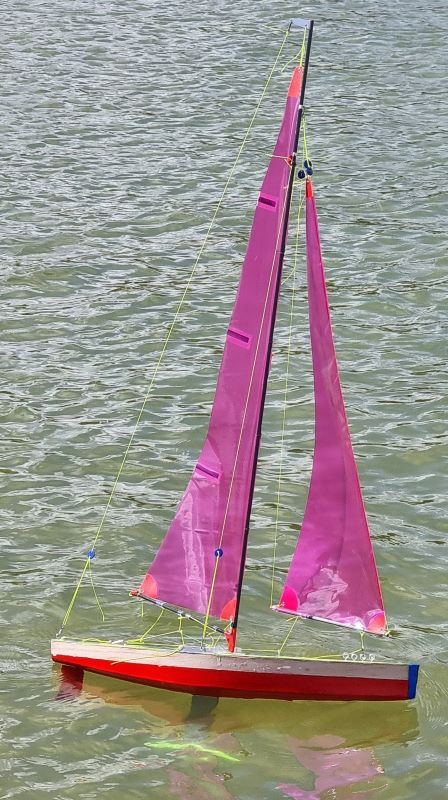
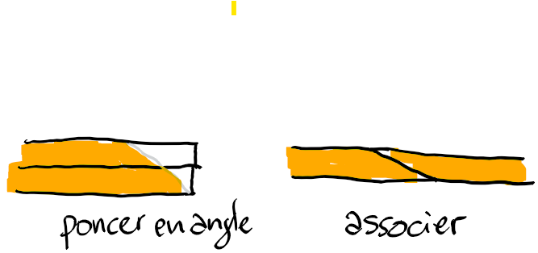
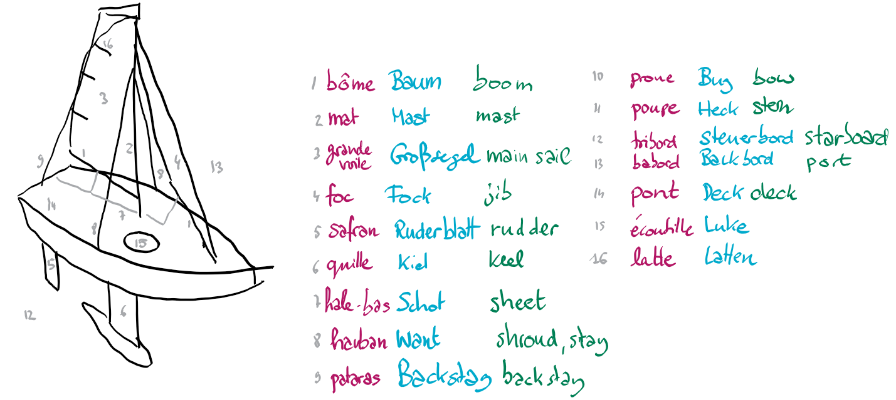
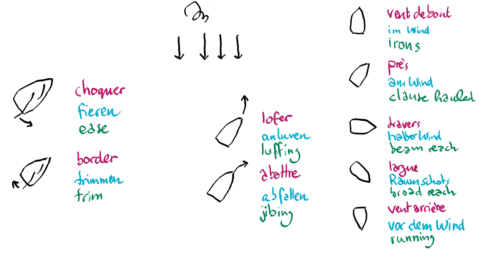
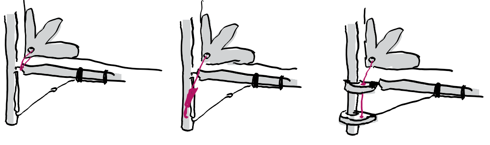

- [histoire](https://rg65.fr/historique-de-la-classe/)
- [plan original](https://www.allradiosailboats.com/design/jif65)
- [instructions in english](https://rcsaling.narod.ru/doc/jif65-mm.pdf)
- [plan des voiles](https://www.frankrusselldesign.com/wp-content/uploads/2016/11/RG65-Sail-Plans.pdf)

## Difficultés rencontrées

- Dans les premières parties du plan de construction on voit que les cadres (*cuardernas*) sont fixés perpendiculairement au plan de travail. Mais plus tard on voit que le coffre de la quille, qui s'adosse sur un des cadres, doit avoir une légère inclinaison.
- J'ai l'impression que mes voiles sont plus petites que sur le plan. Peut-être que j'ai imprimé en taille "paper" au lieu de "A4". Pas clair.
- Quelques nœuds se sont ouverts au bout d'un moment. Alors certains préconisent de les fixer avec une goutte de colle cyanoacrylate. D'autres de les faire fondre rapidement avec un briquet et de laisser un bout du fil dépasser le nœud de 1 centimètre au moins. C'est ce que je fais désormais.
- Concernant la tige filetée qui sort de la quille pour ensuite recevoir un écrou au dessous du pont: J'ai suivi le plan et la tige a fini un peu trop courte. Il vaut mieux la faire plus longue, quitte à scier plus tard la partie qui dépasse.
- Le coffre de la quille est trop serré. Le verni à l'intérieur enlève un peu d'épaisseur. En ponçant la quille j'ai fini par pouvoir l'insérer.
- Les différents tuyaux achetés pour faire des bagues sur la bôme se sont avérés d'un diamètre intérieur trop grand. Aussi il faut vraiment du silicone, le PVC glisse trop facilement.
- Les trous que j'ai fait dans le mat pour accueillir des crochets de fixation de hauban fragilisent le tube de carbone. J'aurais dû coller un bout de tube d'aluminium autour, puis percer.
- J'ai rempli le premier compartiment de morceaux de polystyrène, comme sécurité en cas de fuite. Mais après je me suis rendu compte que ce matériel de couleur bleu clair était en fait à base d'amidon de maïs et se dissout dans l'eau.
- J'ai acheté un moteur servo avec tambour avec l'indication 4T, sans comprendre qu'il s'agit du nombre de tours complet que le tambour peut faire. Je pense que 2.5T aurait été suffisant et donné plus de réactivité du servo.
- Un premier servo 9 grammes avec engrenage métal pour le gouvernail a lâché au bout de 4 heures d'activité. Je suis passé sur un servo un peu surdimensionné, mais qui ne me fera pas défaut.
- J'ai collé le pont avec de la colle à bois blanche, mais je crois que j'aurais dû prendre tout de suite de la colle epoxy. Finalement c'est ce que j'ai dû faire à certains endroits qui se sont décollés.
- J'ai installé un interrupteur étanche sur le pont près de la batterie. Mais pour éviter que les fils du foc ne s'y mêlent, j'aurais dû l'installer à l'arrière.
- Pour fermer les ouvertures sur le pont j'ai d'abord pris un film adhésif en Vinyl qui se vend en rayon décoration à Leroy Merlin. Mais il se décolle à l'eau. Finalement j'utilise soit un couvercle transparent d’emballage alimentaire, soit un film PVC de couverture de document ou de transparent pour des exposés. Et je le colle avec du ruban adhésif Blenderm.
- Pour vernir la coque j'ai pris du verni de meuble normal. Mais il fallait un verni marin.
- J'ai fait mes crochets en corde à piano, mais il fallait du fil Inox qui ne rouille pas.
- Le pont est en deux parties, que j'aurais joindre en angle comme ci-dessous, pour améliorer l'étanchéité.

## Liste d'achats

(non exhaustive)

- [mat, bôme](https://www.decathlon.fr/p/tube-carbone-6mm-x-170-cm/_/R-p-161071) -- Tube carbone 6mm
- [lest](https://www.motionrc.eu/products/bancroft-650mm-rg65-quickfire-green-racing-sailboat-450g-keel-bulb-ballast-bnc1013-115) -- 450g
- [quille](https://www.systeal.com/fr/) -- Profilé aluminium plat 50 mm épaisseur 2 mm
- [servo pour le gouvernail](https://fr.aliexpress.com/item/32957714272.html)
- [servo pour la voile avec bras](https://fr.aliexpress.com/item/32970807476.html) -- finalement pas servi
- [servo pour la voile avec tambour](https://fr.aliexpress.com/item/1005004925970634.html)
- [fil](https://fr.aliexpress.com/item/4001226266031.html) -- mais trop lisse peut-être
- [bras pour le gouvernail](https://fr.aliexpress.com/item/1005003121099895.html)
- [récepteur](https://fr.aliexpress.com/item/1005001681588998.html)
- [UBEC](https://fr.aliexpress.com/item/32574612952.html)
- batterie faite maison avec deux 16850
- film de fleuriste pour la voile -- Rougier et Plé
- renforts de coins de voile -- Rougier et Plé, Tesa Adhésif toilé Extra power
- Balsa 2mm pour la coque, et d'autres tiges carrés -- Lez'arts
- [bois pour le pont](https://fr.aliexpress.com/item/32993858864.html) -- Planche de contreplaqué en bois de tilleul, 2mm
- Ruban adhésif pour écoutilles -- pharmacie, 3M Blenderm

## Vocabulaire

## Accrocher la grande voile en bas

Il existe au moins trois techniques.

1. [Maximo Lange](https://www.allradiosailboats.com/design/jif65)
2. [Jean Galonnier (Janot)](http://rg65.fr/forum/viewtopic.php?f=8&t=474&start=20)
3. [Thomas Rasim](https://www.rc-station.de/seiten/fotos/bilder/img_0004.htm)

## Accrocher la grande voile au mat

- [certains](https://mini-flotte76710.blogspot.com/2021/06/photos-techniques.html) utilisent une boucle en fil, assez prêt du mat
- sur le [Dragon Flite](https://www.pgmodelisme.com/v3/fr/voiliers-prod-pg/682-16781-dragon-flite-95-anneaux-de-voiles-joysway-pg-modelisme.html#/463-attache_de_grand_voile-x10) des anneaux en métal sont utilisés

## Liens

- http://jay-vrc.over-blog.com/tag/ma%20premiere%20construction%20rg65/
- https://b10rrrrrrrrrrrrrrrrrrrrrrrrrrrrrrrrr.e-monsite.com/pages/technique-greements/reglage-des-voiles-par-laurent.html
- https://3dprintedradioyachts.com/stl-file-downloads/
- http://blerovert.free.fr/spip.php?article140
- https://rg-andy.blogspot.com/p/andydesign.html- https://sitakiki.fr/modnaval/nekst.htm
