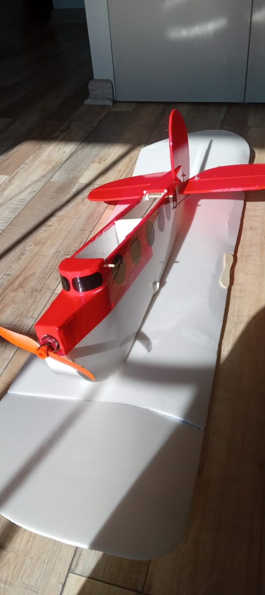
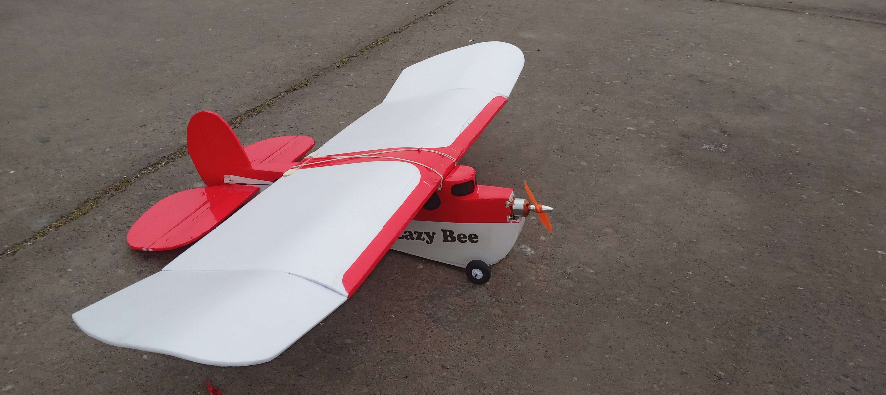

## Matériel

Acheté du carton plume, 11.000 CLP (12 Euros) la plaque de 70x100cm, c'est cher. Pour enlever les feuilles de papier, je l'ai imbibé d'alcool 95 degrées, (70 ne fonctionnait pas). La mousse est un peu plus dense que le Depron et de couleur blanc cassé. Je pense qu'il s'agit de polyuréthane, qui est différent du polystyrène expansé, voir [ici](https://www.milleetunefeuilles.fr/blog-1001-feuilles/4-questions-4-reponses-pour-tout-savoir-sur-le-carton-plume).

L'avion original a été conçu par [Andy Clancy](https://www.andyclancydesigns.com/) en 1992, et était alors vendu en kit balsa.

## Détails techniques

- poids en état de vol ~~160~~ grammes. 
- Non, finalement ce sont devenus 230 grammes. J'ai dû renforcer l'aile en la fermant du côté bas (intrados). Pourvu qu'on reste sous les 250 grammes, quand j'aouterais des roues. 
- envergure 98 cm, corde 27,50cm
- batterie 2S, 450mAh, 19gr.
- contrôle par profondeur, direction
- servos 9 grammes, pourrait être 5 grammes
- moteur [AEORC AFM1306](https://fr.aliexpress.com/item/32751100547.html), 9g, poussée 186g (je crois)
- hélice 5030
- je ne retrouve pas le plan, mais les indications étaient très grossiers. Les formes sont principalement improvisées.

- après j'ai mis une batterie 3S et un autre moteur et ESC. Mais tout est trop lourd.

## Vols

Comme j'aimerais voler:

