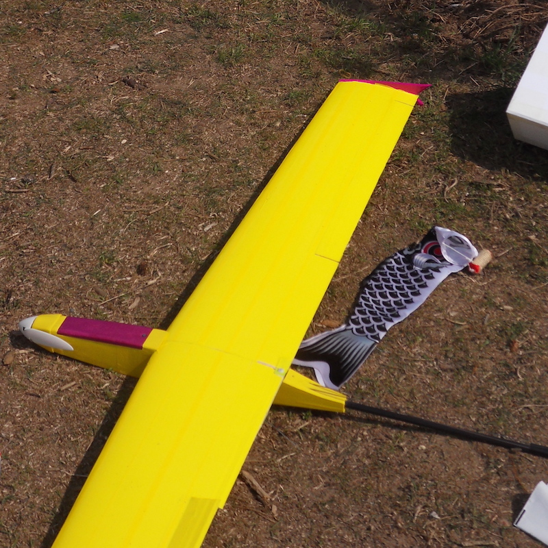
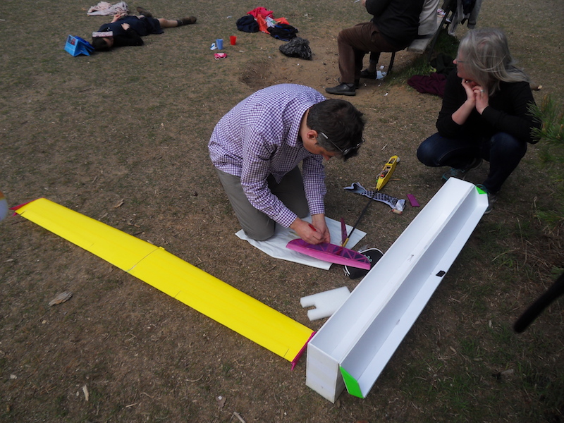

## La conception

Cet avion a été conçu par Lionel Mlinaric, et décrit dans le journal Modèle Magazine juin 2009. L'original est fait tout en structure balsa, entoilé. Il devrait peser 380 grammes. Mais en lisant ce [forum](https://www.modelisme.com/forum/aero-planeurs/131648-aide-construction-planeur-libellule-mlinaric-34.html) il semble que la plupart des constructeurs arrivent plutôt à un poids autour de 470 grammes.

J'ai acheté d'occasion le fuselage avec ses moteurs servos et l'empannage. J'ai juste ajouté une hélice pliable, et une paire d'ailes, un récepteur et une batterie Lipo 3S 1000mA.

## L'aile

Mon aile est découpée au fil chaud dans un bloc de mousse EPO rose. J'ai pris le profil [S7037](http://airfoiltools.com/airfoil/details?airfoil=sd7037-il) comme choisi par le constructeur.

## Problème lors de la découpe

D'abord il y a eu des vibrations sur le fil vers la fin, comme on peut voir sur cette photo.

Puis la fente qui mène vers le trou pour la tige centrale aurait du faire 3 mm de large, mais il en fait 5 mm.  Je pense que le fil était trop chaud et pas assez rapide pendant la découpe.

## Problème des ailerons

Les ailerons sont un peu courbées par rapport à leur emplacement. J'ai décidé de les coller avec du Blenderm, et de recouvrir ensemble aile et ailerons. Ainsi ils auront la même forme.

## Surface

J'ai ajouté une couche de tissu en fibre de verre de 25 g/m2, collé avec un mélange de colle universelle Tesa et d'alcool, en suivant la technique décrite par [Papy Kilowatt](http://papykilowatt.free.fr/html/page_trucs.htm).  Puis j'ai ajouté un scotch jaune pour avoir une surface lisse. Le scotch a ajouté 19 grammes par aile, ce qui représente  20% de son poids.

## Problème de poids

Au total l'avion fait un poids de 600 grammes.  J'ai du mettre pas mal de plomb dans le nez. Mais je trouve qu'il vole remarquablement bien, surtout par rapport au Newton Pusher que j'avais avant.

## La boîte de transport

Fabriqué en carton plume, recouvert d'un film épais, issue d'un publicité pour Ford.

## Premier accident

Au bout d'une minute de vol. En tentant d'attérir je suis entré dans un arbre.  Erreur 1: mauvaise position par rapport au soleil. Erreur 2: mauvaise prise en compte de la dérive par le vent.
