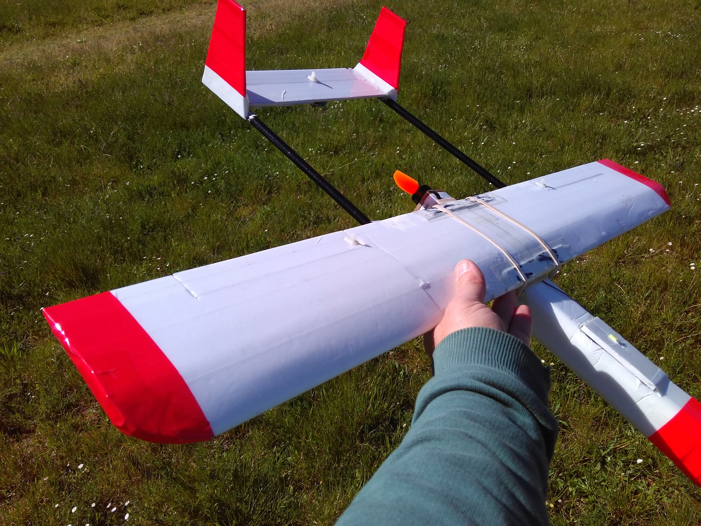
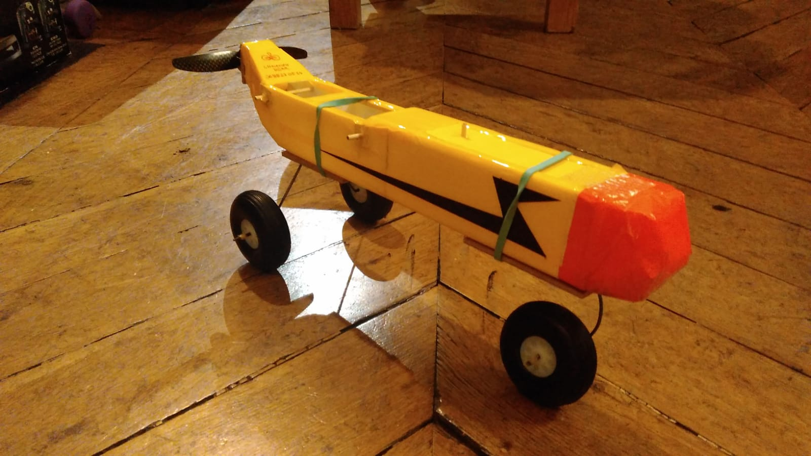

## Micro Sky Hunter

C'est une petite version du sky hunter. Il est [conçu](http://newtonairlines.blogspot.com/search/label/-%20Micro%20Skyhunter) par Andrew Newton, et pèse dans les 250 grammes, pour une envergure de 80 centimètres environ.  Fabriqué en Dépron 3mm, recouvert de ruban adhésif coloré.  Les deux tiges qui relient l'aile avec l’empannage sont coupé d'une canne à pèche. Creuses, elles conduisent le fil vers le servo pour le contrôle de profondeur.   Il peut à la fois voler lentement et très vite, car il a un profil très fin. Le fuselage est très petit, et on galère à y placer sa batterie. Alors qu'il a été construit autour des dimensions de la batterie.

Sans contrôle de direction, il doit être volé à la manière *bank-and-yank*. L'hélice en carbone fait peu de bruit et produit une poussé d'air propre. Le vol est plus lisse qu'avec une hélice en plastique.

Voici un des premiers [vols](https://photos.app.goo.gl/zpXVDPHK7i6VReHq9). 

Voici le fuselage avec un train d'atterissage, beaucoup trop lours d'ailleurs. Il ajoute 150g à un avion qui fait dans les 250g.

