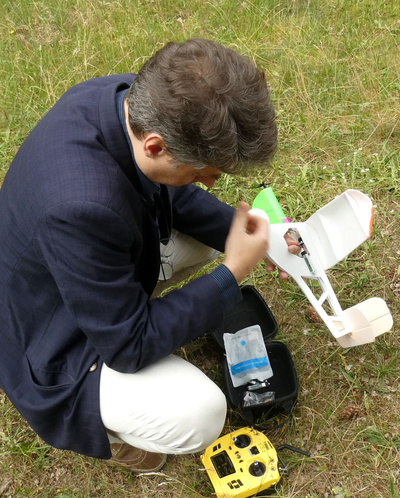

## Small Slowly

C'est la petite version de l'avion *Slowly* conçu par Christian Huber. Il vole de manière très drôle, balancé par le vent. On dirait un avion sorti tout droit d'un dessin animé Tex Avery.  L'électronique est un bloc récepteur avec deux moteurs servo intégrés, et un moteur à brosse qui fait un bruit pas joli.

Le moteur est conçu pour un avion de 35 grammes, alors que celui-ci en pèse 60.  Résultat, il peine à prendre de l'altitude et en cas de vent vole prèsque sur place.

<figure class="video_container">
  <video controls="true" allowfullscreen="true">
    <source src="small_slowly.mp4" type="video/mp4">
    <source src="small_slowly.ogv" type="video/ogv">
    <source src="small_slowly.webm" type="video/webm">
  </video>

</figure>

Et une [autre](https://photos.app.goo.gl/fWRerusQgjrGRbts9) vidéo de cet avion avec un [nouveau moteur](https://fr.aliexpress.com/item/32790519063.html) plus fort, mais néanmoins beaucoup trop de vent pour lui.
