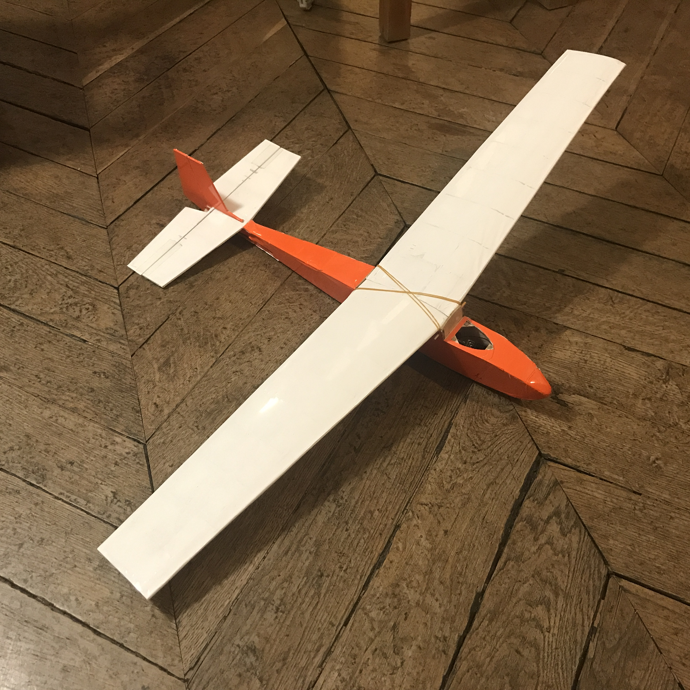
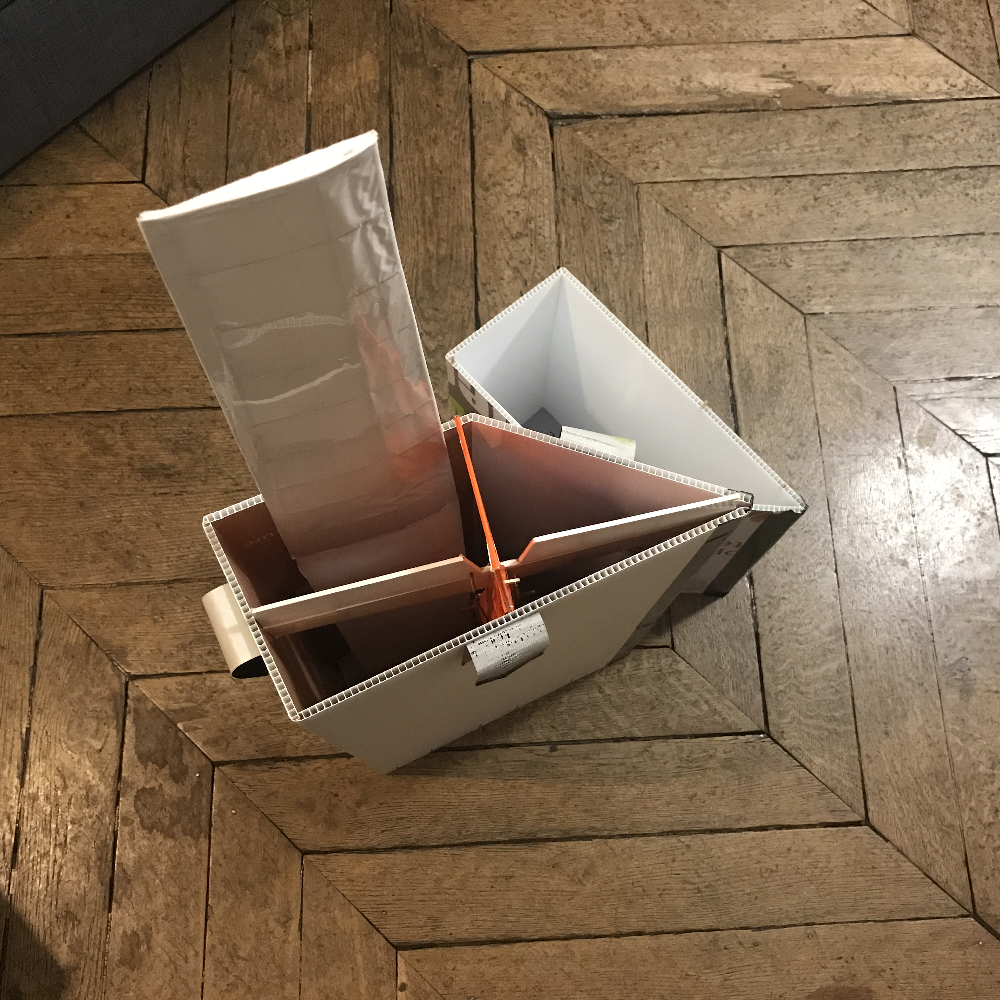

Ce modèle ressemble beaucoup au véritable planeur Swallow.

## Swallow

- Construction en kit balsa
- envergure 90 cm
- poids 157 grammes (devrait faire 165 grammes)
- j'ai perdu la canopée
- lancement par sandow
- 2 batteries en parallèle (pour le centrage) : Lipo 2S 450 mAh

