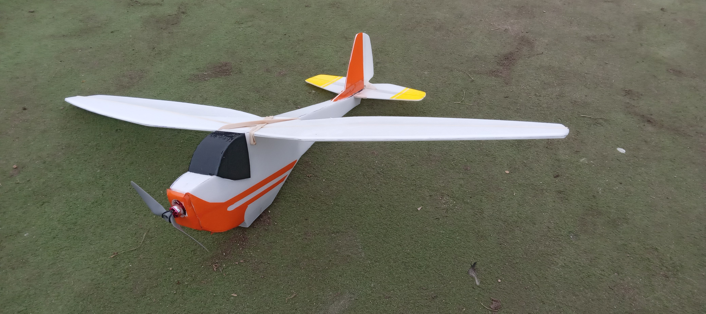

L'avion original a été conçu par [Hilmar Lange](https://www.flugmodell-magazin.de/downloads/valise-kofferfreundlicher-motorsegler/). Il vole lentement, et le stabilisateur horizontal est démontable. Ainsi il est très transportable.

[Vidéo du premier vol](https://photos.app.goo.gl/5gg1df3Tvivm9EvU8).

## Détails techniques

- poids 143g plus la batterie.
- moteur [AEORC AFM1306](https://fr.aliexpress.com/item/32751100547.html), 9g, poussée 186g (je crois)
- hélice 5030

